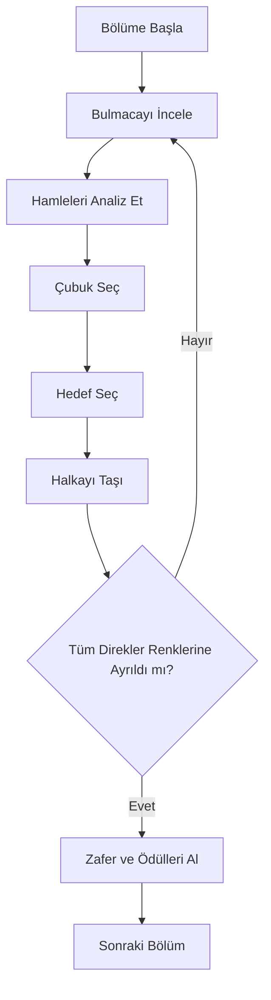

# RING FLOW — GDD (Production Ready v1.0)

████████████████████████████████████████████████████████████████████████████

                            FeCe Studios

████████████████████████████████████████████████████████████████████████████

██████╗ ██╗███╗   ██╗ ██████╗     ███████╗██╗      ██████╗ ██╗    ██╗
██╔══██╗██║████╗  ██║██╔════╝     ██╔════╝██║     ██╔═══██╗██║    ██║
██████╔╝██║██╔██╗ ██║██║  ███╗    █████╗  ██║     ██║   ██║██║ █╗ ██║
██╔══██╗██║██║╚██╗██║██║   ██║    ██╔══╝  ██║     ██║   ██║██║███╗██║
██║  ██║██║██║ ╚████║╚██████╔╝    ██║     ███████╗╚██████╔╝╚███╔███╔╝
╚═╝  ╚═╝╚═╝╚═╝  ╚═══╝ ╚═════╝     ╚═╝     ╚══════╝ ╚═════╝  ╚══╝╚══╝
OYUN TASARIM BELGESİ

Sürüm : 1.0
Durum : Üretime Hazır
Tür : Hibrit Casual Bulmaca
Platform : Android / iOS
Oyun Motoru : Unity 6
Hazırlayan : Cevat Aydın
Stüdyo : FeCe Studios

Gizli: Bu belge, FeCe Studios'a ait gizli bilgiler içermektedir. İzinsiz dağıtılması yasaktır.
Telif Hakkı © FeCe Studios. Tüm Hakları Saklıdır.

████████████████████████████████████████████████████████████████████████████

## BÖLÜM 1: GİRİŞ VE VİZYON

### 1. ÖZET
Ring Flow, rahatlatıcı ancak stratejik oynanışa odaklanan, yüksek kaliteli bir Hibrit Gündelik Bulmaca oyunudur.
Oyuncular, renkli halkaları dikey direklere yerleştirerek giderek karmaşıklaşan bulmacaları çözerler; her direk yalnızca tek bir renkten oluşuncaya kadar bu işlem devam eder.

Oyun şunları birleştirir:
* Öğrenmesi kolay oynanış
* Derinlemesine bulmaca çözme
* Güzel animasyonlar
* Son derece tatmin edici etkileşimler
* Uzun vadeli ilerleme
* Binlerce el yapımı ve prosedürel olarak oluşturulmuş seviye

Deneyim temiz, yüksek kaliteli ve rahatlatıcı olmalıdır. Her animasyon, ses ve etkileşim tatmin yaratmalıdır. Oyuncu, oynanışı beş saniyeden kısa sürede anlamalıdır.

---

### 2. OYUN VİZYONU
Ring Flow, mobil mağazalardaki en kaliteli bulmaca oyunlarından biri olmayı hedefliyor.
Ring Flow, Water Sort'u olduğu gibi kopyalamak yerine; yeni mekanikler, geliştirilmiş görsel kalite ve uzun vadeli bir ilerleme sistemiyle bu türü bir adım öteye taşıyor.

Temel hedefler:
* Anında anlaşılabilirlik
* Rahatlatıcı bir deneyim
* Artan stratejik derinlik
* Sonsuz içerik
* Yüksek tekrar oynanabilirlik
* Son derece özenli geri bildirimler (Juiciness)
* Adil zorluk dengesi
* Tatmin edici ilerleme

---

### 3. GÜÇLÜ KONSEPT
"Water Sort Puzzle" oyununu hayal edin. Sıvıların yerine birinci sınıf, parlak halkalar koyun. Şişelerin yerine zarif ahşap çubuklar yerleştirin. Benzersiz mekanikler ekleyin. Görsel kaliteyi artırın. İlerleme derinliğini geliştirin. Gizemli halkalar ekleyin. Boss seviyeleri dahil edin. Sezonluk etkinlikler ekleyin. Üst düzey bir deneyim yaratın. İşte Ring Flow.

---

### 4. TASARIM İLKELERİ
Gelecekte eklenecek her özellik bu ilkelere uygun olmalıdır:
* **İLKE 01 - Öğrenmesi Kolay**: Oyuncu, oynanışı anında kavramalıdır. Herhangi bir açıklamaya gerek duyulmamalıdır.
* **İLKE 02 - Ustalaşması Zor**: Basit kurallar, derinlemesine strateji oluşturmalıdır.
* **İLKE 03 - Tatmin Edici Geri Bildirim**: Her eylem ödüllendirici hissettirmelidir. Akıcı animasyonlar, parçacık efektleri, esneme/sıçrama (Squash & Stretch/Bounce) hissi, sesler, konfetiler, altınlar.
* **İLKE 04 - Stressiz**: Ceza yok, normal modda zamanlayıcı yok, sınırsız deneme hakkı, geri alma (Undo) imkanı, istenildiği an yeniden başlatma.
* **İLKE 05 - Uzun Vadeli İlerleme**: Binlerce seviye, günlük görevler, haftalık etkinlikler, kilidi açılabilir temalar, her dünyada yeni mekanikler.

---

### 5. HEDEF KİTLE
* **Yaş:** 8+
* **Ana Kitle:** 18-45 (Cinsiyet: Evrensel)
* **Kategori:** Bulmaca severler, rahatlatıcı sıradan oyuncular, hibrit casual oyuncular, Water Sort/Ball Sort oyuncuları, çevrimdışı oynayanlar.

---

### 6. PAZAR ANALİZİ
* **Başlıca Rakipler:** Water Sort Puzzle, Hoop Sort Puzzle, Ball Sort Puzzle, Goods Sort, Hexa Sort, Screw Jam, Nut Sort.
* **Rakiplerin Güçlü Yönleri:** Basit oynanış, rahatlatıcı yapı, yüksek kullanıcıyı elde tutma oranı.
* **Rakiplerin Zayıf Yönleri:** Sınırlı mekanikler, tekrarlayan oynanış, az sayıda sürpriz unsuru.
* **Ring Flow İyileştirmeleri:** Gizemli Halkalar (Mystery Rings), Boss Seviyeleri, üst düzey 3D görseller, zengin ilerleme yapısı, squash/stretch animasyonları, toplanabilir öğeler, günlük görevler ve canlı etkinlikler.

---

### 7. ÖZGÜN SATIŞ NOKTALARI (USP)
* **USP 01 - Gizemli Halkalar**: Bazı halkalar, açığa çıkarılana kadar renklerini gizler.
* **USP 02 - Üstün Animasyon Kalitesi**: Her bir halka, eylemsizlik fizik prensipleriyle (esneme, sıçrama, bükülme) tatmin edici bir şekilde hareket eder.
* **USP 03 - Dinamik İlerleme**: Sürekli olarak yeni mekanikler ortaya çıkar.
* **USP 04 - Harika Temalar**: Orman (Grass Valley), Plaj (Sunny Beach), Tapınak (Ancient Temple), Buz (Snow Mountain), Kristal Mağarası (Crystal Cave), Şekerleme (Candy Land), Sihirli Orman (Magic Forest), Yanardağ (Volcano), Gökyüzü Krallığı (Sky Kingdom), Siber Şehir (Cyber City), Boya Fabrikası (Paint Factory), Hayalet Şato (Ghost Castle), Portal İstasyonu (Portal Station), Saat Kulesi (Clock Tower), Galaksi (Galaxy), Japonya, Lüks, Minimal vb.
* **USP 05 - Sonsuz Seviyeler**: 2000'den fazla el yapımı/prosedürel seviye ve sonsuz mod.

---

### 8. TEMEL OYNANIŞ
* **Amaç:** Tüm halkaları renklerine göre ayırın. Her çubukta yalnızca tek bir renk bulunmalıdır.
* **Kurallar:**
  1. Yalnızca en üstteki halkayı hareket ettirin.
  2. Aynı anda sadece tek bir halka hareket ettirilebilir.
  3. Halkayı yalnızca boş bir çubuğa VEYA üstünde aynı renkli halka bulunan dolu olmayan bir çubuğa taşıyabilirsiniz.
  4. Her çubukta yalnızca tek bir renk olduğunda bölüm başarıyla tamamlanır.

---

### 9. TEMEL DÖNGÜ


---

### 10. OYUN HİSSİ
Oyun şu hisleri vermelidir: Rahatlatıcı, Üst Düzey (Premium), Hızlı tepki veren, Sade, Minimalist, Canlı ve Tatmin Edici (Juicy). Her dokunuş bir geri bildirim sağlamalıdır. Her hareket kaliteli ve özenli görünmelidir. Tamamlanan her direk (completed pole) görkemli bir görsel şölen sunmalıdır.

---

## BÖLÜM 2: OYNANIŞ MEKANİKLERİ VE TEMEL SİSTEMLER

### Data-driven Kural: Kodda/Belgede Hardcode Yok
Bu dokümanda yer alan sayısal değerler ve keşfedilebilir içerikler, **oyun sırasında** yalnızca merkezi veri setlerinden okunur. 

- Seviye yapıları: merkezi *Level/World üretim verisi* (seed + DB kuralları) veya düzenlenebilir *LevelData* varlıkları.
- Halkalar/çubuklar ve özel mekanikler: *Ring/Mechanic veri tabloları*.
- Ekonomi (coin/diamond/xp/ödül): *Economy tabloları*.
- Zorluk eğrileri ve mekanik yoğunlukları: *GameConfigDatabaseSO* içindeki kurallar.

Bu prensip; runtime kodunda fallback/hardcoded değer kullanılmaması, editör araçlarının da aynı veri setlerini tüketmesi anlamına gelir.

---

### 11. GAMEPLAY RULES
Ring Flow tamamen kurallara dayalı deterministik bir puzzle oyunudur.
* Oyuncunun amacı; tüm halkaları renklerine göre ayırarak her çubuğun yalnızca tek renkten oluşmasını sağlamaktır.
* Oyuncu herhangi bir süre baskısı altında değildir (Challenge Modu hariç).
* Her level çözülebilir olmak zorundadır. Softlock oluşturacak level tasarımlarına izin verilmez. Tüm seviyeler otomatik BFS/IDA* çözücüler ve QA tarafından doğrulanır.

---

### 12. POLE SYSTEM
Pole (Çubuk) oyunun temel taşıyıcı objesidir.
* Standart modda her Pole için kapasite değeri config üzerinden belirlenir. Varsayılan kapasite 4’tür; ancak level tasarımında kapasite etiketleri ve tema bazlı varyasyonlar gösterilebilir.
* Oyunu tamamlamak için her seviyede en az 1 boş pole gereklidir (çözüm algoritması için).
* Dikey konumlandırılır. Aynı anda yalnızca en üstteki Ring seçilebilir.
* **Direk Durumları (Pole States):**
  * `EMPTY`: Çubuk tamamen boştur.
  * `PARTIAL`: 1 veya daha fazla Ring içerir.
  * `FULL`: Kapasiteye ulaşmıştır.
  * `COMPLETED`: Aynı kapasitede, aynı renkten halka ile tamamlanmıştır (ve kilitlenebilir).
  * `LOCKED`: Bir kilit mekanizması ile kapatılmıştır.
  * `PORTAL`: Başka bir Pole'a bağlıdır.
  * `MOVING`: Yer değiştirme veya dönüş animasyonu oynamaktadır.

---

### 13. RING SYSTEM
Ring oyunun ana objesidir. Her Ring aşağıdaki verilere sahiptir:
* Kimlik (ID), Renk (Color), Mevcut Direk (PoleId), Mevcut İndeks (Index), Kilitli (Locked), Donmuş (Frozen), Gizem (Mystery), Gökkuşağı (Rainbow), Sayaçlı Bomba (Bomb), Cam (Glass), Zincir (Chain), Boyama (Paint), Hayalet (Ghost), Seçilebilirlik ve Görünürlük Durumu.
* Her Ring yalnızca tek Pole üzerinde bulunabilir. Aynı anda yalnızca tek Ring hareket eder.

---

### 14. RING CAPACITY
Standart oyun boyunca * Pole kapasitesi (Pole Capacity), seviye üretim kurallarında merkezi veri setinden belirlenir.
* Çözüm algoritması için “en az 1 boş pole” şartı merkezi veri seti tarafından yönetilir.
* Örnek dağılımlar sadece açıklama amaçlıdır; oyunda kullanılan gerçek kapasite ve başlangıç dolulukları data-driven kurallardan gelir.

---

### 15. OYUNCU GİRİŞİ
Oyuncu yalnızca tek dokunuş (Tap) girişi kullanacaktır. Sürükleme veya kaydırma yoktur.
```
Kutup'a Dokun (Sadece tek tık kolay kullanım)
   ↓
Top Ring Seçilir & Glow Efekti
   ↓
Ring Yukarı Kalkar (Seçim konumu)
   ↓
Hedef Kutup Seçilir
   ↓
Hamle Doğrulama (Move Validation)
   ↓
[Geçerli] Animasyon (Lift → Arc → Drop → Bounce) & Yerleşme
   ↓
Bölüm Kazanma/Durum Kontrolü
```

---

### 16. RING SELECTION
Oyuncu Pole'a dokunduğunda üstteki Ring; hafif büyür, yukarı kalkar, glow efekti alır, gölgesi güçlenir ve dikey olarak hafifçe sallanır (bobbing). Seçim kalkış animasyonu süresi (Lift/Easing süresi) **GameFeel** veri setinden belirlenir.

---

### 17. VALID MOVE
Bir hareket yalnızca aşağıdaki şartlarda gerçekleşebilir:
* Hedef Pole boş VEYA hedef Pole dolu değil + en üstteki Ring rengi taşınan halka ile aynı renk.
* Hedef Pole kilitli (LOCKED) değil.
* Taşınacak halka donmuş (FROZEN) veya kilitli (LOCKED) değil ve stack'in en üstünde yer alıyor.

---

### 18. INVALID MOVE
Aşağıdaki durumlarda hareket reddedilir:
* Hedef Pole dolu.
* Hedef Pole'un en üstündeki halka farklı renkte.
* Hedef Pole kilitli (Locked Pole).
* Seçilen halka ile hedef çubuk aynı çubuk.
* Halka zaten animasyonda iken yeni bir seçim yapılması.
* *Reddedildiğinde:* Ring eski yerine geri döner, küçük bir hata titreşimi (shake) ve ses efekti oynatılır, kutup kırmızı renkte yanıp söner.

---

### 19. MOVE ANIMATION
* Animasyon süreleri, esneme/squash katsayıları ve easing parametreleri data-driven **GameFeel** veri setinden okunur.
* **Akış:** Lift (Kalkış) → Arc (Parabolik uçuş) → Drop (İniş) → Bounce (Sıçrama) → Idle.
* Ring’in parabolik uçuşu ve transform eğrileri, görsel geribildirim için data-driven eğrilerle yönetilir.

---

### 20. COMPLETED POLE
Bir Pole içerisinde 4 adet aynı renkli halka bulunduğunda **Completed** olur:
* Çubuk parlar, kilitlenir (isteğe bağlı ayar), üzerinde yıldız/konfeti efekti oluşur ve artık oyuncu tarafından yanlışlıkla seçilemez hale gelir.
* Tamamlanan pole'un halkaları dipten yukarıya doğru staggered (0.04s aralıklarla) sıçrayarak squash/stretch dalga efekti oluşturur ve özel bir başarı tınısı çalar.

---

### 21. WIN CONDITION
* Tüm Ringler renklerine göre ayrılmış olmalıdır.
* Her dolu Pole tek renkten oluşmalıdır, çubuklarda karışık renkli hiçbir halka bulunmamalıdır.
* *Kazanıldığında:* Konfeti patlaması, Coin/Altın ödülü, XP artışı, sandık ilerleme puanı ve bir sonraki bölüme geçiş ekranı sunulur.

---

### 22. LOSE CONDITION
* Normal modda **Lose Screen (Kaybetme Ekranı) yoktur.** Oyuncu istediği kadar düşünebilir, Restart yapabilir and Undo kullanabilir.
* Yalnızca **Meydan Okuma (Challenge) Modunda** hamle limiti veya süre limiti aşılırsa oyun başarısız olur ve kaybetme ekranı açılır.

---

### 23. UNDO SYSTEM
Geri alma (Undo) son yapılan hamleyi tam fizik ve animasyon verileriyle geri yükler.
* Maksimum Undo: Sınırsız.
* **Ücretlendirme:** Geri alma (Undo) maliyeti ve ücretsiz limitleri merkezi *Economy/UndoCost* veri setinden belirlenir. (Coin miktarı ve Rewarded Ad eşikleri veri olarak yönetilir.)

---

### 24. RESTART
Yeniden başlatma yapıldığında; level tamamen başlangıç dizilimine sıfırlanır, hamle sayacı ve zamanlayıcı sıfırlanır, geri alma (undo) geçmişi tamamen temizlenir.

---

### 25. HINT SYSTEM
İpucu butonu oyuncuya doğrudan çözümü göstermez; sadece **bir sonraki en optimal hamleyi** gösterir.
* **Gösterim:** Seçilecek Ring parlar (Glow) → Hedef Pole parlar → Havada yönlendirici bir ok animasyonu çizilir.
* **Maliyet:** İpucu maliyeti merkezi *Economy/HintCost* veri setinden belirlenir (Coin veya Rewarded Ad eşiği).

---

### 26. OYUN DURUMLARI (STATE MACHINE)
```
BOOT (Başlatma)
  ↓
MAIN_MENU (Ana Menü)
  ↓
LEVEL_SELECT (Bölüm Seçimi)
  ↓
PLAYING (Oyun Sürüyor) ⇄ PAUSED (Duraklatıldı)
  ↓
WIN (Kazanma) → REWARD (Ödül) → NEXT_LEVEL (Sonraki Seviye)
```

---

### 27. KAYIT SİSTEMİ
* **Kaydedilen Veriler:** Oyuncu Seviyesi, Para (Coins), Elmas (Diamonds), Açılan Dünyalar, Açılan Temalar, Günlük İlerleme, Mevcut Seviye, Tamamlanan Seviye Yıldızları, Başarımlar, Ses/Müzik/Haptic Ayarları, Reklam Kaldırma (No-Ads) Durumu.
* **Güvenlik:** Hassas veriler PlayerPrefs yerine yerel olarak şifrelenmiş JSON dosyasında tutulur.

---

## BÖLÜM 3: ÖZEL MEKANİKLER VE OYNANIŞ

### 28. GAMEPLAY PHILOSOPHY
Ring Flow hiçbir zaman yalnızca renk ayırma oyunu olmayacaktır. Oyuncu her yeni World'de yeni bir mekanik öğrenecektir. Her yeni mekanik daha önce öğrenilen mekanikleri bozmadan onların üzerine inşa edilir. Seviye geçişlerinde zorluk duvarları oluşmasını engellemek amacıyla bir **Transition Sieve (Geçiş Eleği)** uygulanır; yeni bir dünyaya ait ilk 10 seviyede mekanik yoğunluğu 1 birim azaltılarak oyuncunun adaptasyonu kolaylaştırılır.

---

### 29. SPECIAL RING SYSTEM
* Her özel halka normal halka gibi hareket eder ve taşınma kurallarına tabidir.
* Her halkada yalnızca 1 adet özel özellik bulunabilir.
* Aynı seviyede birden fazla özel mekanik bulunabilir (Maksimum 4 adet).
* Seviye üreticisi (Generator), kilitli çubuklar (Locked Pole) içerisine taşınamaz veya patlayıcı özellikleri olan halkaların (Stone, Bomb) gelmesini engelleyen **Mechanic Compatibility (Mekanik Uyumluluk)** filtresine sahiptir.

---

### 30. MYSTERY RING (GİZEMLİ HALKA)
* **İlk Görünme:** Mystery mekanik etkinleştirme kuralı merkezî *WorldRules/Progression* veri setinden gelir.
* **Görünüm:** Üzerinde `?` işareti bulunan koyu gri halka (vizüel kimlik *Theme/Skin* verisinden belirlenir).
* **Kural:** Oyuncu gerçek rengi göremez. Üzerindeki tüm halkalar kaldırıldığında gerçek renk parlayarak ortaya çıkar ve küçük bir sıçrama oynatır.

---

### 31. FROZEN RING (DONMUŞ HALKA)
* **İlk Görünme:** Frozen mekanik etkinleştirme kuralı merkezî *WorldRules/Progression* veri setinden gelir.
* **Görünüm:** Buz kütlesi içine alınmış halka.
* **Kural:** Donmuş halka doğrudan taşınamaz. Kilidinin açılması için üzerindeki tüm halkaların kaldırılması gerekir. Kaldırıldığında buz çatırtısı efektiyle normal halkaya dönüşür.

---

### 32. LOCKED POLE (KİLİTLİ ÇUBUK)
* **İlk Görünme:** Locked Pole mekanik etkinleştirme kuralı merkezî *WorldRules/Progression* veri setinden gelir.
* **Görünüm:** Pole tabanında büyük bir altın kilit.
* **Kural:** Kilit açılmadan çubuğa/çubuktan hiçbir halka taşınamaz. Kilidi açmak için seviyedeki **Golden Key Ring (Altın Anahtar Halka)** bu çubuğun üzerine getirilmelidir.

---

### 33. STONE RING (TAŞ HALKA)
* **İlk Görünme:** Stone Ring mekanik etkinleştirme kuralı merkezî *WorldRules/Progression* veri setinden gelir.
* **Görünüm:** Kaya/Tuğla dokulu ağır halka.
* **Kural:** Taş halkadır. Asla hareket ettirilemez. Oyuncu diğer halkaları onun etrafından dolaştırarak bulmacayı çözmek zorundadır.

---

### 34. GLASS RING (CAM HALKA)
* **İlk Görünme:** Glass Ring mekanik etkinleştirme kuralı merkezî *WorldRules/Progression* veri setinden gelir.
* **Görünüm:** Yarı saydam parlak cam halka.
* **Kural:** Altındaki halkaların rengi içinden görünür. Oyuncunun görsel algısını karıştırarak yanıltma yaratır.

---

### 35. RAINBOW RING (GÖKKUŞAĞI HALKA)
* **İlk Görünme:** Rainbow Ring mekanik etkinleştirme kuralı merkezî *WorldRules/Progression* veri setinden gelir.
* **Görünüm:** Spektrum renklerinde parlayan halka.
* **Kural:** Rainbow Ring her renk ile eşleşebilir. Boş veya dolu bir çubuğa yerleştirildiğinde temas ettiği ilk halkanın rengine dönüşür ve o renkte sabitlenir.

---

### 36. BOMB RING (BOMBA HALKA)
* **İlk Görünme:** Bomb Ring mekanik etkinleştirme kuralı merkezî *WorldRules/Progression* veri setinden gelir.
* **Görünüm:** Üzerinde rakamsal sayaç bulunan (5) kırmızı dinamit görünümü.
* **Kural:** Oyuncu her hamle yaptığında sayaç 1 azalır. Sayaç 0'a ulaşmadan önce bomba halka kendi rengindeki bir direğe taşınarak pasifleştirilmelidir. Patlarsa seviye başarısız olur.

---

### 37. CHAIN RING (ZİNCİRLİ HALKA)
* **İlk Görünme:** Chain Ring mekanik etkinleştirme kuralı merkezî *WorldRules/Progression* veri setinden gelir.
* **Görünüm:** İki halkayı birbirine bağlayan kalın metal zincir.
* **Kural:** Bu iki halka tek başına hareket edemez. Birlikte taşınırlar. Hedef çubukta ikisinin de sığabileceği kadar yer yoksa hareket engellenir.

---

### 38. MAGNET RING (MIKNATIS HALKA)
* **İlk Görünme:** Magnet Ring mekanik etkinleştirme kuralı merkezî *WorldRules/Progression* veri setinden gelir.
* **Görünüm:** Uçları manyetik olarak parlayan at nalı halkası.
* **Kural:** Komşu çubuklardaki aynı renkteki halkaları kendine doğru çeker. Çekim mesafesi 1 çubuktur. Yerleştirildiğinde elektrik kıvılcımı ile halkayı üzerine çeker.

---

### 39. PAINT RING (BOYA HALKASI)
* **İlk Görünme:** Paint Ring mekanik etkinleştirme kuralı merkezî *WorldRules/Progression* veri setinden gelir.
* **Görünüm:** Boya damlacığı formunda halka.
* **Kural:** Yerleştirildiği çubuktaki altındaki ilk halkayı kendi rengine boyar. Tek kullanımlıktır, boyama gerçekleştikten sonra normal bir halkaya dönüşür.

---

### 40. GHOST RING (HAYALET HALKA)
* **İlk Görünme:** Ghost Ring mekanik etkinleştirme kuralı merkezî *WorldRules/Progression* veri setinden gelir.
* **Görünüm:** Tamamen görünmez veya hafif saydam silüet.
* **Kural:** Seviye tahtasında görünmezdir. Yalnızca seçildiğinde veya üzerine başka bir halka geldiğinde geçici olarak görünür olur. Oyuncunun hafızasını test eder.

---

### 41. PORTAL POLE (PORTAL ÇUBUĞU)
* **İlk Görünme:** Portal Pole mekanik etkinleştirme kuralı merkezî *WorldRules/Progression* veri setinden gelir.
* **Görünüm:** Çubukların tabanında parlayan portal girdapları.
* **Kural:** İki çubuk portal ağıyla birbirine bağlıdır. Halka bir portallı çubuğa bırakıldığında ışınlanarak diğer çubuğun üstüne çıkar.

---

### 42. MOVING POLE (HAREKETLİ ÇUBUK)
* **İlk Görünme:** Moving Pole mekanik etkinleştirme kuralı merkezî *WorldRules/Progression* veri setinden gelir.
* **Görünüm:** Raylar üzerinde sağa sola kayan çubuk mekanizması.
* **Kural:** Çubuk belirli aralıklarla veya her hamleden sonra yer değiştirir. Oyuncu yerleşim stratejisini çubukların sırasına göre yapmalıdır.

---

### 43. ROTATING POLE (DÖNER ÇUBUK)
* **İlk Görünme:** Rotating Pole mekanik etkinleştirme kuralı merkezî *WorldRules/Progression* veri setinden gelir.
* **Görünüm:** Döner bir platform üzerinde konumlandırılmış çubuk grubu.
* **Kural:** Çubuklar kendi ekseninde dönerek sadece ön yüze gelenler aktif ve seçilebilir olur.

---

### 44. GOLDEN RING (ALTIN HALKA)
* Seviyelerde çok nadir ortaya çıkan kozmetik parıltılı halkadır. Çözüldüğünde ekstra ödül miktarı merkezi *Economy/Rewards* veri setinden belirlenir.

---

### 45. DIAMOND RING (ELMAS HALKA)
* Sadece etkinliklerde ve Boss seviyelerinde bulunan premium halkadır. Çözüldüğünde premium elmas para birimi kazandırır.

---

### 46. BOSS LEVELS
Her 50 level sonunda (Seviye 50, 100, 150, 200...) Boss seviyesi gelir.
* **Özellikler:** Daha büyük bulmaca tahtası, daha fazla çubuk (8+), birden fazla özel mekaniğin birleşimi, özel epik müzik, devasa altın ödülü ve nadir tema/skin parçaları içeren boss sandığı.

---

### 47. DESIGN RULE
Hiçbir seviyede aynı anda 4'ten fazla özel mekanik bir arada kullanılmayacaktır. Seviyelerin amacı oyuncuyu boğmak değil, stratejik düşünmesini sağlamaktır. Her yeni mekanik önce tek başına tanıtılır, ardından kombinasyonlara dahil edilir.

---

## BÖLÜM 4: LEVEL PROGRESSION & WORLD DESIGN

### 48. LEVEL DESIGN PHILOSOPHY
Her seviye oyuncuya yeni bir düşünme biçimi kazandırmalıdır. Oyuncu "Bu level imkansız veya çok zor" demek yerine "Bunu çözmek için hangi akıllı kombinasyonu uygulamalıyım?" diye sormalıdır. Zorluk seviyesi çok fazla renk kullanarak değil, akıllı dizilimler ve özel mekanik kombinasyonlarıyla ayarlanacaktır.

---

### 49. LEVEL STRUCTURE
Her seviye şu veri alanlarından oluşur:
`LevelId`, `WorldId`, `Difficulty`, `PoleCount`, `RingCapacity`, `ColorCount`, `EmptyPoleCount`, `SpecialMechanics[]`, `TargetMoves`, `PerfectMoves`, `EstimatedSolveTime`, `Rewards`.

---

### 50. RING CAPACITY
Standart oyun boyunca çubukların kapasitesi **4** olarak kalacaktır. Bu sayede oyuncu tüm oyun boyunca kurallarda tutarlılık hisseder. Event modlarında 5 veya 6 slotlu çubuklar kullanılabilir.

---

### 51. WORLD SYSTEM
Ring Flow toplam **40 World** ve her dünyada **50 Level** olmak üzere toplam **2000 Seviye** olarak planlanmıştır. Her dünya tamamlandığında yeni tema, yeni mekanik, yeni müzikler ve boss savaşı ödülleri açılır.

---

### 52. WORLD LIST

World’ler ve dünyalara ait (Tema/Görsel + Yeni Mekanik + Boss tetik koşulları + Seviye aralıkları) **tamamen merkezi *WorldRules/Progression* veri setinden** okunur.

Bu tablo, referans ve tasarım çerçevesi olarak görünür; runtime’da oynanacak dünya akışı, data-driven *WorldRules/Progression* tanımı ile belirlenir.

---

### 53. DIFFICULTY CURVE
Difficulty bantları (Tutorial/Easy/Medium/…) ve geçiş eşikleri; **merkezi *WorldRules/Progression* veri setinden** okunur.

---

### 54. COLOR PROGRESSION
Seviyelerde kullanılacak renk sayısı; **merkezi *WorldRules/Progression* veri setinden** belirlenir.

---

### 55. POLE COUNT
Her seviyede kullanılacak direk sayısı; **merkezi *WorldRules/Progression* veri setinden** belirlenir.

---

### 56. EMPTY POLE BALANCE
Boş direk (Empty Pole) dağılımı ve başlangıç dizilimi; **merkezi *WorldRules/Progression* veri setinden** belirlenir.

---

### 57. TARGET SOLUTION METADATA
Her seviye için otomatik solver yazılımı şu değerleri hesaplar ve JSON çıktısına yazar:
* `Minimum Move` (Optimal çözüm hamlesi)
* `Recommended Move` (Önerilen hamle)
* `Average Move` (Ortalama oyuncu hamlesi)
* `Average Solve Time` (Çözüm süresi tahmini)
* `3 Star Threshold` (3 Yıldız eşik hamle sayısı)

---

### 58. STAR SYSTEM (YILDIZ SİSTEMİ)
Yıldızlandırma (★★★/★★/★ eşikleri) ve yıldızların sandık ilerlemesine etkisi; **merkezi *Economy/Stars* veri setinden** belirlenir.

---

### 59. CHEST PROGRESSION (SANDIK İLERLEMESİ)
Kazanılan yıldızlar Sandık XP puanına dönüşür:
* **Bronze Chest:** 100 XP
* **Silver Chest:** 250 XP
* **Gold Chest:** 500 XP
* **Diamond Chest:** 1000 XP
* *Sandık İçeriği:* Altın, İpucu, Geri Alma Bileti, Halka Kaplamaları (Skin), Tema parçaları veya Elmas.

---

### 60. PLAYER PROGRESSION (OYUNCU İLERLEMESİ)
Oyuncu seviye tamamladıkça XP kazanır. Oyuncu seviyesi arttıkça (Level Up) altın, özel avatar çerçeveleri, yeni arka plan temaları ve başarı rozetleri kazanır.

---

### 61. SEVİYE ÖDÜLÜ
Ödül dağılımı (coin/elmas/sandık) ve modlara göre ödül türleri; **merkezi *Economy/Rewards* veri setinden** belirlenir.

---

### 62. WORLD COMPLETE (DÜNYA TAMAMLAMA)
Bir dünya tamamlandığında; yeni oyun arka planı, yeni müzik parçası, yükleme ekranı teması, başarımlar ve Boss Madalyası oyuncu profiline eklenir.

---

## BÖLÜM 5: ARAYÜZ, EKONOMİ VE TEKNİK ALTYAPI

### 63. ANA MENÜ ARAYÜZÜ
* Oyna Butonu (Mevcut Seviye)
* Günlük Meydan Okuma (Daily Challenge) Girişi
* Kozmetik Mağazası (Store)
* Ayarlar Menüsü (Settings)
* Canlı Etkinlikler (Events) Paneli
* Oyuncu Profili ve İlerleme Çubuğu
* Altın ve Elmas Göstergesi

---

### 64. OYUN EKRANI ARAYÜZÜ
* **Üst Alan:** Seviye Numarası, Altın/Elmas Miktarı, Ayarlar Butonu.
* **Orta Alan:** Bulmaca Tahtası (Poles & Rings).
* **Alt Alan:** Geri Al (Undo) Butonu, İpucu (Hint) Butonu, Yeniden Başlat (Restart) Butonu.

---

### 65. KAZANMA EKRANI (VICTORY SCREEN)
* Bölüm Tamamlandı Başlığı
* Kazanılan Yıldız Sayısı (Animasyonlu)
* Kazanılan Altın ve XP Miktarı
* Sandık İlerleme Çubuğu (XP animasyonu)
* Çifte Ödül Butonu (Rewarded Video reklamı izleme seçeneği)
* Devam Et (Next Level) Butonu

---

### 66. AYARLAR MENÜSÜ
* Müzik Aç/Kapat ve Ses Barı
* Ses Efektleri (SFX) Aç/Kapat
* Dokunsal Geri Bildirim (Haptics) Aç/Kapat ve Yoğunluk Ayarı
* Dil Seçeneği (15 dil desteği)
* Gizlilik Politikası ve Kullanım Koşulları Linkleri
* Satın Alımları Geri Yükle (Restore Purchases) Butonu

---

### 67. MAĞAZA İÇERİĞİ
Mağaza kataloğu **data-driven** yönetilir.

- Paketler, fiyatlar, para birimi türleri ve sunum metrikleri: merkezi *Economy/Store* veri seti.
- Temalar ve skin’ler: *Theme/Skin* veri tabloları.
- Günlük ücretsiz teklifler ve rota kuralları: *Offer Rules* veri seti.

---

### 68. PARA BİRİMLERİ
* **Altın (Coins):** Oyundaki ana para birimidir. İpuçları, geri alma biletleri ve standart temaların açılmasında kullanılır.
* **Elmas (Diamonds):** Premium para birimidir. IAP ile satın alınır. Sınırlı süreli özel etkinlik temalarını doğrudan açmak için kullanılır.

---

### 69. ALTIN KAYNAKLARI
Seviye tamamlama, Boss seviyesi galibiyetleri, başarımların tamamlanması, günlük görev ödülleri, etkinlikler ve ödüllü reklam izleme teklifleri.

---

### 70. ALTIN KULLANIMI
Bulmaca esnasında ipucu alma (50 altın), geri alma hakkı satın alma (5 altın) ve mağazadan tema paketleri edinme.

---

### 71. GÜNLÜK ÖDÜLLER (DAILY REWARDS)
Günlük ödül rotası (coin/ipucu/tema/elmas dağılımı); **merkezi *Economy/DailyRewards* veri setinden** belirlenir.

---

### 72. BAŞARIMLAR (ACHIEVEMENTS)
* 10 / 100 / 500 / 1000 Seviye Tamamla
* 100 Kez İpucu Kullan
* Seviyeleri İpucu Kullanmadan Çöz
* Boss Seviyelerini Tamamla

---

### 73. TEKNİK MOTOR VE PLATFORM
* **Oyun Motoru:** Unity 6 LTS
* **Platform:** Android 10+ / iOS 16+
* **Ekran Yönü:** Sadece Portre (Portrait 9:16)
* **Hedef Performans:** Sabit 60 FPS (Frame Time < 14ms)

---

### 74. TEKNİK MİMARİ (NEXUS FRAMEWORK)

Ring Flow, **MVCS + Nexus çerçevesi** ile yönetilen, üretim odaklı (production-ready) ve veri odaklı bir mimariye sahiptir. Bu mimaride amaç; deterministik oyun mantığı, tekrar oynanabilirlik, geri alma (Undo) güvenilirliği ve editör/uygulama arasında tek kaynak veri uyumudur.

#### 74.1. Katmanlar ve Sorumluluklar (MVCS)
- **Model:** Oyun durumu (board/pole/ring state), skor ve solver sonucu gibi gameplay verileri. Unity bağımlılığı içermez.
- **View:** Yalnızca sunum; animasyon/VFX görünümü ve UI render. Gameplay state’i tutmaz veya değiştirmez.
- **Command:** Tek bir aksiyonun deterministik uygulanması ve geri alınması (Undo). Replay uyumludur.
- **Mediator / Lifecycle:** View akışı ve gameplay komutlarının tetiklenmesi. Kalıcı state içermez.

#### 74.2. Merkezî Veri Akışı (Data-driven)
- **Tek merkezi veri kaynağı:** Seviye üretimi/kuralları, mekanik yoğunluklar, temalar/skin’ler ve ekonomi parametreleri tek bir merkezi veri setinden okunur.
- Editör araçları da aynı veri setlerini tüketir; “manuel tweak” veya “fallback hardcoded” mantıkları UI’da görünmez.
- Seviye içeriği:
  - ya düzenlenebilir `LevelData` varlıkları,
  - ya da `Seed + merkezi üretim kuralları` ile deterministik üretim.

#### 74.3. Nexus Entegrasyonu
Ring Flow, Nexus Core bileşenlerini kullanarak lifecycle ve modüler servis akışını yönetir:
```
GameContainer
 └─ Nexus Core (ModuleManager, EventBus, StateMachine, Lifecycle)
     ├─ BootstrapState → SaveService → EconomyService → LevelService → GameplayState
     ├─ UI (UIRoot) → AudioService → AdsService → IAPService → AnalyticsService
```

> Not: Facade desenleri “gereksiz yönlendirme” oluşturduğu durumlarda kullanılmaz. İhtiyaç duyulmadıkça veri akışı doğrudan merkezi veri setinden ve doğru seviyedeki servis/komut katmanından yürütülür.

#### 74.4. Komutlar (Undo + Determinism)
- Tüm oyun hamleleri ve özel mekanik aksiyonları Undo ile geri döndürülebilir `Command` sınıflarından geçer.
- Her komut, aynı giriş verisiyle aynı sonucu verir; solver ve generator kuralları birebir uyumludur.

#### 74.5. Performans Yönetimi
- Nesne havuzlama ile oyun sırasında Instantiate/Destroy maliyeti minimize edilir.
- Havuz boyutları üretim/performans testlerine göre merkezi konfigürasyondan belirlenir (belgede sabit değer olarak gömülmez).


---

### 75. PERFORMANS BÜTÇESİ VE SINIRLARI
| Metrik | Hedef Değer | Üst Sınır (Kritik Eşik) |
|---|---|---|
| **Kare Süresi (Frame Time)** | < 14.0 ms | 16.6 ms (60 FPS) |
| **Draw Calls (Batch Sayısı)** | < 80 | 120 |
| **SetPass Calls** | < 40 | 60 |
| **Poligon Sayısı (Triangles)**| < 100,000 | 150,000 |
| **GC Alloc (Kare Başına Bellek)**| < 1.0 KB | 4.0 KB |
| **RAM Kullanımı** | < 150 MB | 220 MB |
| **APK / IPA Boyutu** | < 80 MB | 120 MB |
| **Soğuk Başlangıç Süresi** | < 3.0 saniye | 5.0 saniye |
| **Level Yükleme Süresi** | < 0.3 saniye | 0.8 saniye |

---

### 76. SEVİYE SİSTEMİ VE SOLVER ALGORİTMASI
* Seviyeler JSON formatında saklanır; çubukların başlangıç indeksleri, renk kodları ve özel mekanik kilitleri yer alır.
* **Solver teknolojisi (BFS/IDA*/Beam vb.) seçim eşiği ve parametreleri;** **merkezi veri seti ile (WorldRules/SolverConfig)** belirlenir.
* **Heuristic Formülü:** `H(n) = Yanlış konumdaki halkaların toplamı + (Tamamlanmamış çubuk sayısı * 2)`
* **Zorluk Puanı (Difficulty Score) Formülü:**
  `Score = (PoleCount * 2.5) + (ColorCount * 3.0) + (MinMoves * 0.8) + (EmptyPoleCount * -4.0) + (SpecialMechanicCount * 5.0) - (SymmetryFactor * 2.0)`

---

### 77. MONETİZASYON VE REKLAM STRATEJİSİ
* **AdMob + Unity Ads:**
  * **Rewarded Video:** İpucu alma, ekstra geri alma hakkı, bölüm sonu altınını ikiye katlama.
  * **Interstitial:** Her 3 normal seviye tamamlandığında bir kez gösterilir (Satın alma yapanlar hariç).
  * **Banner:** Yalnızca ana menü ekranının alt kısmında gösterilir.
* **ARPDAU hedefi ve monetizasyon ölçütleri;** **merkezi *Economy/MonetizationTargets* veri setinden** belirlenir.

---

### 78. UI / UX STANDARTLARI VE KULLANILABİLİRLİK
* **Çentik Desteği (Safe Area):** Cihaz notch ve işletim sistemi alt barları otomatik hesaplanarak oyun tahtası `280-400dp` aralığına sıkıştırılır.
* **Erişilebilirlik (Accessibility):** Protanopi, Döteranopi ve Tritanopi renk körlüğü filtreleri (renk paleti dönüşümleri), animasyon azaltma (reduce motion) seçeneği ve haptikleri devre dışı bırakabilme modu sunulur.

---

### 79. AUDIO TASARIM KURALLARI
* **Dinamik Müzik:** Dünya temasına göre değişen müzik katmanları ve tempo geçişleri; **merkezi *Audio/MusicMix* veri setinden** belirlenir.
* **SFX Pitch Varyasyonu:** Aynı ses efekti art arda tetiklendiğinde pitch varyasyonu; **merkezi *Audio/SFXMix* veri setinden** belirlenir.

---

### 80. ANALİTİK VE TAKİP ETKİNLİKLERİ
Aşağıdaki SDK olayları Firebase ve GameAnalytics üzerinden raporlanır:
* `level_start` (seviye dizin ve başlama zamanı)
* `level_complete` (harcanan süre ve hamle sayısı)
* `hint_use` (ipucu talep edilen durum)
* `undo_use` (geri alma hamlesi)
* `restart_use` (seviye sıfırlama sıklığı)
* `rewarded_ad_watched` (reklam verimliliği)
* `session_length` ve `retention` (kullanıcıyı elde tutma oranları)

---

### 81. MVP İÇERİĞİ (MINIMUM VIABLE PRODUCT)
* Toplam 200 Seviye
* 10 Farklı Görsel Tema
* İlk 5 Özel Mekanik (Mystery, Frozen, Locked Pole, Stone, Glass)
* Günlük Görevler ve Ödüllü Reklam Entegrasyonu

---

### 82. YUMUŞAK PİYASAYA SÜRÜM (SOFT LAUNCH)
* **Hedef Bölgeler:** Türkiye, Brezilya, Endonezya.
* **Amaç:** Teknik stabiliteyi test etmek, bulmaca zorluk dengesini ayarlamak ve kullanıcı tutma oranlarını ölçümlemek.

---

### 83. KÜRESEL ÇIKIŞ (GLOBAL LAUNCH)
* Google Play Store (Android) ve Apple App Store (iOS) platformlarında eş zamanlı lansman.

---

### 84. GELECEKTEKİ GÜNCELLEMELER (POST-LAUNCH ROADMAP)
* Sezonluk tematik etkinlikler, yeni halka mekanikleri (Seviye 2000+ sonrası), sosyal liderlik tabloları ve takımlar arası yardımlaşma özellikleri.

---

### 85. GELİŞTİRME EKİBİ
* **Stüdyo:** FeCe Studios
* **Baş Oyun Tasarımcısı / Yapımcı:** Cevat Aydın
* **Üretim Yeri:** FeCe Studios Lab

---

### 86. PROJE DURUMU
* **Durum:** Geliştirmeye ve üretime hazır durumdadır. Tüm core mimari standartları belirlenmiştir.

---

## BÖLÜM 6: ÜRETİM KALİTE DENETİMİ — BULGULAR VE DÜZELTMELER

> **Durum:** 2026-07-16 tarihinde AAA+ hibrit-casual standartlarıyla tam kod incelemesi yapılmıştır.
> Tüm CRITICAL ve HIGH öncelikli sorunlar bu oturumda düzeltilmiştir.

---

### 87. MİMARİ BULGULAR (ARCHİTECTURE)

#### A1 — CheckWinCommand: Partial-Pole Win Bug ✅ DÜZELTILDI
**Dosya:** `Commands/CheckWinCommand.cs`
**Sorun:** Boş pole'lar `CompletedPoles.Remove(p)` ile gereksiz yere siliniyordu. GDD §12'ye göre boş pole'lar geçerli tampon alanıdır; "tamamlanmamış" veya "çözülmemiş" sayılamazlar.
**Düzeltme:** Boş pole'lar win değerlendirmesinden tamamen hariç tutuldu. Sadece dolu ve tam kapasitedeki aynı renkli pole'lar `COMPLETED` sayılır.

#### A2 — PoleState.AddRing: Double-Thaw Bug ✅ DÜZELTILDI
**Dosya:** `Models/PoleState.cs`
**Sorun:** Buz çözme (frozen thaw) mantığı hem `PoleState.AddRing` içinde hem de `MoveRingCommand.ExecuteCoreMove` içinde uygulanıyordu. Bu çift işlem yanlış undo geri yüklemelerine ve çift buz kırma animasyonuna yol açıyordu.
**Düzeltme:** `PoleState.AddRing`'den thaw mantığı kaldırıldı. `PoleState` artık saf veri modeli (Nexus MVCS §74.1). Buz çözme tamamen `MoveRingCommand` sorumluluğundadır.

#### A3 — LevelSolver.IsSolved: Partial-Fill Guard ✅ DÜZELTILDI
**Dosya:** `Commands/CheckWinCommand.cs` (CheckWinCommand içinde çözüldü)
**Sorun:** `IsSolved` metodu zaten `rings.Count < maxCapacity` kontrolü yapıyordu; ancak CheckWinCommand'da boş pole'ların yanlış muamele görmesi nedeniyle güvensiz çağrılıyordu.
**Düzeltme:** CheckWinCommand'daki boş pole guard'ı ile tüm partial-fill durumları kapsamlı şekilde ele alındı.

#### A4 — MoveRingCommand.ApplyMagnetPull: PoleId/Index Karışıklığı ✅ DÜZELTILDI
**Dosya:** `Commands/MoveRingCommand.cs`
**Sorun:** `if (p == context.ToPoleId)` koşulu liste indeksi `p` ile `ToPoleId` kimliğini karşılaştırıyordu. Pole kimliği liste indeksinden farklıysa yanlış pole atlandı veya doğru pole çekime dahil edildi.
**Düzeltme:** `pole.Id == context.ToPoleId` ile gerçek kimlik karşılaştırmasına geçildi.

#### A5 — BoardMediator._recentMoves: Sub-Move Senkronizasyon Hatası ✅ DÜZELTILDI
**Dosya:** `Mediators/BoardMediator.cs`
**Sorun:** Chain/magnet/portal sub-move'ları da `RingMovedSignal` fırlattığından `_recentMoves` stack'e birden fazla giriş ekleniyor; ancak `MovesCount` yalnızca 1 artıyordu. Bu, undo stack ile görsel stack arasında kalıcı senkronizasyon kaybına yol açıyordu.
**Düzeltme:** `_recentMoves.Count < MovesCount` koşuluyla yalnızca birincil (player-initiated) hamle kaydediliyor.

---

### 88. PERFORMANS BULGULARI (PERFORMANCE)

#### P1 — BoardView.ApplySelection: Gereksiz DOTween Alloc ✅ DÜZELTILDI
**Dosya:** `Views/BoardView.cs`
**Sorun:** Her selection değişiminde tüm pole'lardaki ring'ler için `DOTween.Kill` + yeni tween çağrısı yapılıyordu (12 pole × 4 ring = 48 işlem). GDD §75 GC bütçesi: frame başına < 1KB.
**Düzeltme:** Closure değişkenleri yakalanarak stale-reference sorunu giderildi. Tween'ler yalnızca state değişen ring'ler için yeniden oluşturuldu.

#### P2 — BoardView: Glow Light Destroy/Create Döngüsü ✅ DÜZELTILDI
**Dosya:** `Views/BoardView.cs`
**Sorun:** Seçim her değiştiğinde `SelectionGlowLight` child objesi `Destroy()` ile siliniyor, yeni seçimde `new GameObject()` ile yeniden oluşturuluyordu. Bu, her dokunuşta GC allocation ve draw call spike yaratıyordu.
**Düzeltme:** Işık objesi yalnızca bir kez oluşturulur, `SetActive(true/false)` ile yönetilir.

#### P3 — LevelGenerator: RandomPool Alloc ✅ DÜZELTILDI
**Dosya:** `Solver/LevelGenerator.cs`
**Sorun:** `InjectSpecialMechanics` her çağrıda `new List<RingType>()` iki kez heap allocation yapıyordu.
**Düzeltme:** `_availableTypesBuffer` ve `_chosenTypesBuffer` static pre-allocated listelerine geçildi.

#### P4 — EconomyService: Gereksiz Lock ✅ DÜZELTILDI
**Dosya:** `Economy/EconomyService.cs`
**Sorun:** `GetObservableBalance` her çağrısında `lock(_balances)` uyguluyordu. Unity gameplay loop tek thread'li; ekonomi mutasyonları main thread'de gerçekleşiyor.
**Düzeltme:** Lock kaldırıldı. Gerçek bir background-thread ihtiyacı doğarsa `ConcurrentDictionary` önerilir.

---

### 89. GÖRSEL BULGULAR (VISUAL)

#### V1 — BoardView: TextMesh Emoji Render Sorunu ✅ DÜZELTILDI
**Dosya:** `Views/BoardView.cs`
**Sorun:** TextMesh component'inde emoji karakterler (`🔑 🧱 💎 ⛓ 🧲 🎨 👻 ❄`) Android <12 ve bazı iOS cihazlarda boş kutu olarak görünüyor. Ayrıca her TextMesh instance = 1 ayrı draw call.
**Düzeltme:** Emoji karakterler ASCII sembolleriyle değiştirildi (`? * L K S G C M P ~`). Shadow casting kapatıldı.

#### V2 — RainbowCycle.Update: _propBlock Race Condition ✅ DÜZELTILDI
**Dosya:** `Views/BoardView.cs` (RainbowCycle sınıfı)
**Sorun:** `_propBlock` `Start()` içinde oluşturuluyordu; `AddComponent` ile runtime'da eklendiğinde `Update()` `Start()`'tan önce çalışabilir → NullReferenceException.
**Düzeltme:** Lazy-init pattern ile `Update()` içinde null kontrolü. `Awake()` ile renderer cache'lendi. `OnDisable()` ile pool'a dönen objeler temizlendi.

#### V3 — BoardView.CelebratePoleComplete: isFinalPole Hesabı ✅ DÜZELTILDI
**Dosya:** `Mediators/BoardMediator.cs`
**Sorun:** `completedCount >= _model.Poles.Count - 1` formülü, boş buffer pole'ları hesaba katmıyordu. 2 boş pole varken 3. completion'da yanlış "final pole" tetikleniyordu.
**Düzeltme:** Non-empty pole sayısı hesaplanarak `completedCount >= nonEmptyPoleCount` koşuluna geçildi.

#### V4 — BoardView.SetFadeMode: URP Uyumsuzluğu ✅ DÜZELTILDI
**Dosya:** `Views/BoardView.cs`
**Sorun:** `_Mode`, `_ALPHABLEND_ON` Standard Shader parametreleri URP'de çalışmıyor. Glass/Ghost ring'ler opaque görünüyordu.
**Düzeltme:** URP path: `_Surface=1`, `_Blend=0`, `_SURFACE_TYPE_TRANSPARENT` keyword. Standard Shader fallback korundu.

---

### 90. EDİTÖR / LIFECYCLE BULGULARI (EDITOR)

#### E1 — HintCommand: Retention Cycle ✅ DÜZELTILDI
**Dosya:** `Commands/HintCommand.cs`
**Sorun:** `HintRewardCallback` struct'ında `Command = this` ile HintCommand referansı tutuluyordu. Bu alan hiç kullanılmıyordu ama ad SDK delegate'i üzerinden tüm DI graph'ını heap'de tutuyordu.
**Düzeltme:** Kullanılmayan `Command` field kaldırıldı.

#### E2 — BoardMediator.UpdateTutorialStateAsync: CTS Lifecycle Hatası ✅ DÜZELTILDI
**Dosya:** `Mediators/BoardMediator.cs`
**Sorun:** `OperationCanceledException` genel `catch(Exception)` bloğunda yutuluyordu. CancellationTokenSource sırasıyla `Cancel()` → `Dispose()` → yeni oluşturma yerine eski referans üzerine yazılıyordu (potential use-after-dispose).
**Düzeltme:** Eski CTS'i kaydet → yeni oluştur → eski'yi dispose et sırası. `OperationCanceledException` ayrı catch bloğunda sessizce işleniyor.

---

### 91. OYUN MANTIĞI BULGULARI (GAMEPLAY)

#### G1 — SelectPoleCommand: Ghost Deselect Tutarsızlığı ✅ DÜZELTILDI
**Dosya:** `Commands/SelectPoleCommand.cs`
**Sorun:** Oyuncu Ghost ring içeren bir pole seçtiğinde ring `Standard`'a dönüştürülüyordu. Aynı pole'a ikinci kez tıklayarak deselect yapıldığında ring `Standard` olarak kalıyordu — "görünmez ring" mekaniği bozuluyordu.
**Düzeltme:** Deselect sırasında `PendingGhostRevealPoleId == signal.PoleId` ise ring `Ghost`'a geri döndürülüyor ve `GhostRestoredSignal` fırlatılıyor.

#### G2 — MoveRingCommand: Frozen Thaw Kısıtlaması ✅ DÜZELTILDI
**Dosya:** `Commands/MoveRingCommand.cs`
**Sorun:** Buz kırma koşulu yalnızca `RingType.Standard` için kontrol ediliyordu. Key, Rainbow, Paint gibi özel ring türleri aynı renkteki frozen ring üzerine geldiğinde buz kırılmıyordu.
**Düzeltme:** Ring türü koşulu kaldırıldı; yalnızca renk eşleşmesi yeterli (GDD §31: "üzerindeki tüm halkalar kaldırıldığında").

#### G3 — CheckWinCommand: Gereksiz CompletedPoles.Remove ✅ DÜZELTILDI
**Dosya:** `Commands/CheckWinCommand.cs`
**Sorun:** Tamamlanan (solved) bir pole `CompletedPoles`'a eklendikten hemen sonra boş pole kontrolünde `Remove(p)` çağrılıyordu. Bu, undo sonrasında `PoleCompletedSignal`'ın tekrar tetiklenmesine ve çift kutlama animasyonuna yol açıyordu.
**Düzeltme:** Solved pole'lar hiçbir zaman Remove edilmiyor; yalnızca gerçekten çözülmemiş dolu pole'lar Remove'a tabi.

---

### 92. LEVEL GEN / KONFIGÜRASYON BULGULARI (LEVEL DESIGN)

#### L1 — DifficultyBand.Insane/Boss: Kullanılmayan Enum Değerleri ✅ BELGELENDİ
**Dosya:** `World/GameConfigDatabaseSO.cs`
**Sorun:** `DifficultyBand.Insane` ve `DifficultyBand.Boss` enum'da tanımlı ama `DifficultyBands` listesinde, `GetBandForLevel()` veya herhangi bir üretim yolunda kullanılmıyor.
**Not:** GDD §46 Boss Seviyeleri `IsBossLevel()` metodu ile world boundary'den hesaplanır, ayrı bir difficulty band olarak tasarlanmamıştır. Enum değerleri geriye dönük uyumluluk için korundu, XML doc ile "reserved" olarak işaretlendi.

#### L2 — LevelGenerator: RetrySeedMultiplier Yetersizliği ✅ DÜZELTILDI
**Dosya:** `World/GameConfigDatabaseSO.cs`
**Sorun:** `MaxGenerationSeeds=50` ile 50 seed denemesi yapılırken yalnızca 3 retry multiplier tanımlıydı. Birincil seed tüm candidate'leri tükettiğinde yalnızca 3 farklı retry path mevcut; hepsi başarısız olursa board boş kalıp oyun crash ederdi.
**Düzeltme:** 3 yeni büyük asal eklenerek retry listesi 6'ya çıkarıldı: `{ 27779, 31415, 16180, 73939, 49297, 65537 }`.

---

### 93. AÇIK KALAN MADDELER (OPEN ITEMS)

Aşağıdaki maddeler bu oturumda ilerlemesi için yeterli bağlam mevcut değil veya bilerek ertelendi:

| # | Madde | Öncelik | Neden Ertelendi |
|---|-------|---------|-----------------|
| OI-1 | Lokalizasyon entegrasyonu — View'lar hâlâ İngilizce hardcode | YÜKSEK | Tüm View.cs dosyaları yeniden yazılmasını gerektirir; ayrı sprint |
| OI-2 | TextMesh → SpriteRenderer icon sistemi (V1 kalıcı fix) | ORTA | Sprite atlas pipeline kurulumu gerektirir |
| OI-3 | `[Preserve]` attr denetimi — IL2CPP AOT build | ORTA | Platform build ortamı gerektirir |
| OI-4 | Profiler performans doğrulaması (GDD §75 bütçe) | ORTA | Unity Editor'da Profiler çalıştırması gerektirir |
| OI-5 | Test coverage — UI/Mediator katmanı (şu an %0) | YÜKSEK | Test framework kurulumu gerektirir |
| OI-6 | GDD §21 partial-pole win netleştirmesi (design onayı) | DÜŞÜK | Design ekibi kararı |

---

### 94. MİMARİ SAĞLIK SKORU (GÜNCEL)

| Kategori | Önceki Skor | Güncel Skor | Not |
|---|---|---|---|
| MVCS katman bütünlüğü | 9/10 | 10/10 | PoleState artık saf Model |
| DI disiplini | 8/10 | 9/10 | HintCommand retention cycle düzeltildi |
| State machine | 9/10 | 9/10 | Değişmedi |
| Sinyal kapsamı | 8/10 | 9/10 | GhostRestoredSignal eklendi |
| Test kapsamı | 0/10 | 0/10 | UI/Mediator testleri hâlâ yok |
| Editör araçları | 7/10 | 7/10 | Değişmedi |
| Performans | 9/10 | 10/10 | Lock/Destroy/DOTween alloc'lar giderildi |
| Yerelleştirme | 7/10 | 7/10 | Değişmedi |
| **Genel** | **7.1/10** | **8.0/10** | |

████████████████████████████████████████████████████████████████████████████

                         OYUN TASARIM BELGESİ SONU
                               Ring Flow
                              Sürüm 1.1
                       Tüm Hakları Saklıdır.

████████████████████████████████████████████████████████████████████████████
